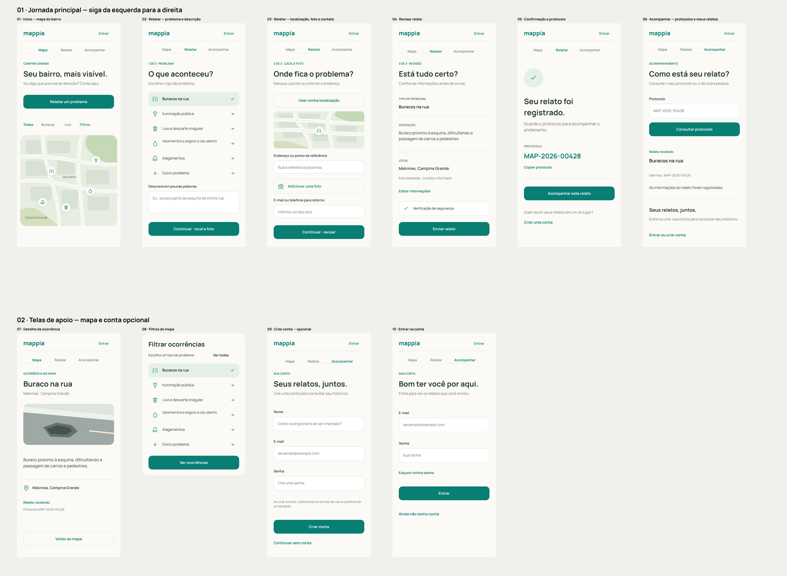

# Mappia

Projeto de extensão em fase de planejamento e protótipo.

O Mappia propõe uma plataforma web para registrar e acompanhar problemas do bairro, com envio de ocorrências sem cadastro obrigatório, consulta por protocolo e moderação antes da publicação no mapa.

## Funcionalidades previstas

- Registro de ocorrências com categoria, localização e foto opcional.
- Protocolo para acompanhamento sem conta e cadastro opcional após o envio.
- Mapa público, filtros e indicadores das ocorrências validadas.
- Área de moderação com controle de acesso e atualização de estados.
- Evoluções para comércio local, doações, voluntariado e alertas comunitários.

## Documentação

- [PRD](docs/prd/PRD_Mappia.pdf)
- [Product Backlog](docs/product-backlog/Product_Backlog_Mappia.pdf)

## Protótipo

### Visualizar as telas

- [Abrir a imagem em tamanho completo](docs/design/telas-organizadas.png)
- [Navegar pelo protótipo no Figma](https://www.figma.com/proto/sXNaua5CmhShdvoC4J4upn/Mappia?node-id=2031-152&page-id=0%3A1&starting-point-node-id=2031%3A152&scaling=scale-down)

A jornada principal segue da esquerda para a direita: início e mapa, descrição do problema, localização e foto, revisão, confirmação com protocolo e acompanhamento. Abaixo estão as telas de apoio: detalhe da ocorrência, filtros, criação de conta e entrada.

As telas representam um protótipo em desenvolvimento. O envio de relatos, a localização, o anexo de fotos e a criação de conta são demonstrações; não há atendimento público integrado.

### Colaborar no design

[Abrir o arquivo editável no Figma](https://www.figma.com/design/sXNaua5CmhShdvoC4J4upn/Mappia?node-id=2045-121)

A edição depende de um convite com permissão **Pode editar** enviado ao e-mail do colaborador no Figma. Este link não concede edição automaticamente. O GitHub apresenta a prévia e a documentação; as telas são editadas no arquivo original do Figma.

## Equipe e contexto acadêmico

Projeto de quatro estudantes de Ciência da Computação da UNINASSAU Campina Grande, na disciplina Atividades Práticas Interdisciplinares de Extensão I.

- [João Vitor Regis](https://github.com/joaovitorregis)
- [Ryan Cavalcante](https://github.com/Ryancscarvalho)
- [Joalison Normandia](https://github.com/joalisonnormandia)
- [Jhonatan Xavier](https://github.com/jhonatandevpb)

## Licença

A documentação e os designs de autoria da equipe Mappia estão sob [CC BY 4.0](LICENSE), incluindo o PRD, o Product Backlog e o protótipo identificado neste README.

Autoria: João Vitor Regis, Ryan Cavalcante, Joalison Normandia e Jhonatan Xavier. Ao reutilizar, credite os autores, informe as alterações e inclua um link para a licença.

Elementos de terceiros conservam seus próprios direitos e licenças. A licença não concede direitos sobre marcas, imagem ou dados pessoais.
